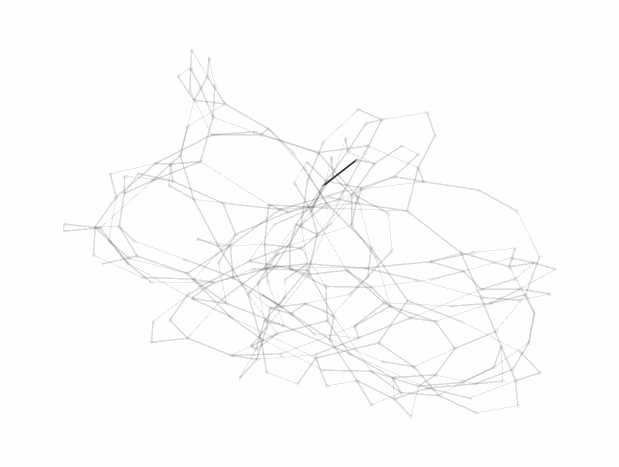
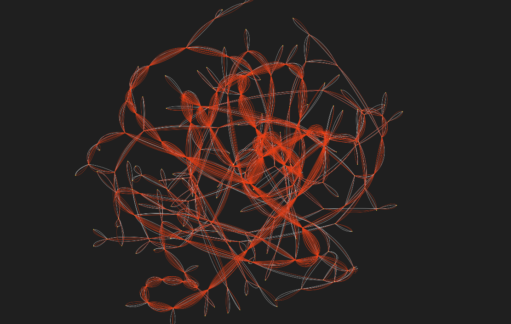

# 1. Add permission to execute the script:
chmod +x main.sh
# 2. Run Drone Simulation:
./main.sh drone Sector,City,Country

# 3. Run Snow Removal Simulation:
./main.sh snow_removal Sector,City,Country

# ⚠️ Warning
You need to have conda 4.13.0 installed and added to your path.

Works only on macos!

If u want to run it on another OS:

You need to check the path of conda.sh and replace it in the script where there is source command 

The lines to replace are located in the main.sh file at the root of the project:

line 27: source ~/opt/anaconda3/etc/profile.d/conda.sh

line 74: source ~/opt/anaconda3/etc/profile.d/conda.sh 

# Donate  🙏 and Have FUN 🤩
paypal.me/project_maintainer (JK)

# Snow Removal Circuit Simulation , Leynhac, France

# Model Comparaison Drone , Outremont, Montreal, Canada , Hmmm... Why it Cost More ...?

  
  

# Model comparaison Drone Simulation, Leynhac, France

*Normal Circuit*

*Opti circuit*

# For fun: Play with the graph

